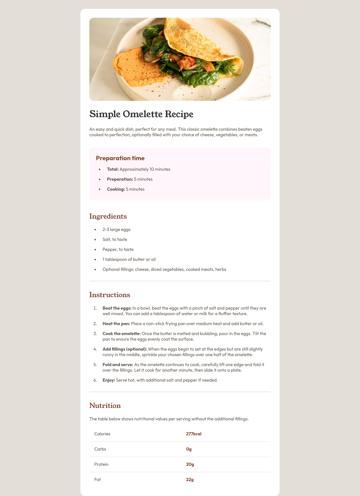

# Frontend Mentor - Recipe page solution

This is a solution to the [Recipe page challenge on Frontend Mentor](https://www.frontendmentor.io/challenges/recipe-page-KiTsR8QQKm). Frontend Mentor challenges help you improve your coding skills by building realistic projects.

## Table of contents

- [Overview](#overview)
  - [Screenshot](#screenshot)
  - [Links](#links)
- [Author](#author)

## Overview

### Screenshot

### Links

- Solution URL: [github](https://github.com/4lxs/fm-recipe-page-main)
- Live Site URL: [github pages](https://4lxs.github.io/fm-recipe-page-main/)

## Author

- Github - [4lxs](https://github.com/4lxs)
- Frontend Mentor - [@4lxs](https://www.frontendmentor.io/profile/4lxs)
